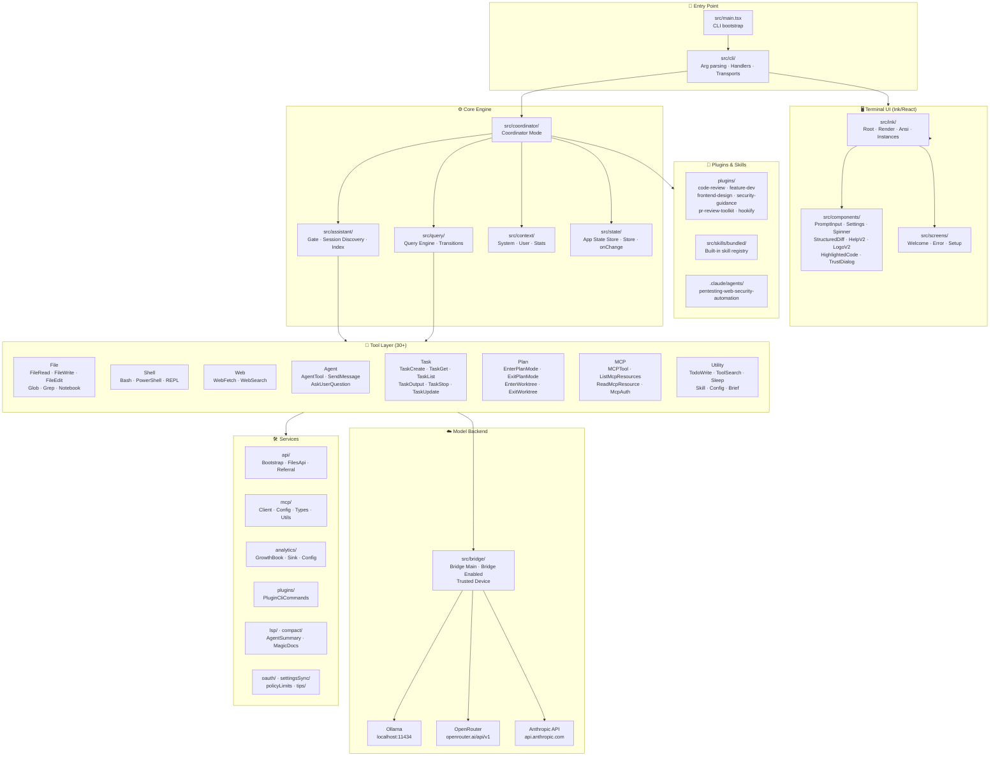
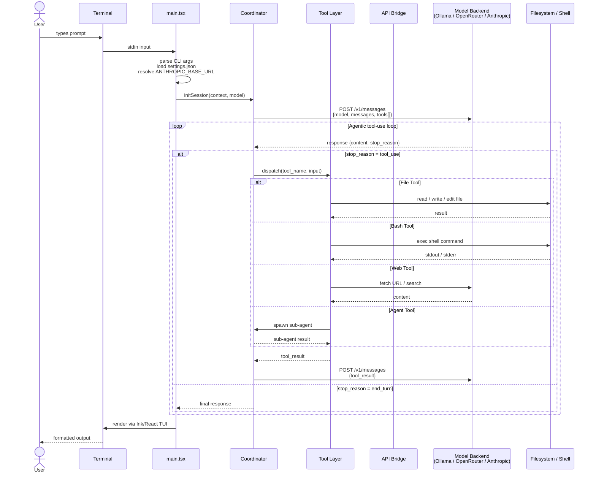
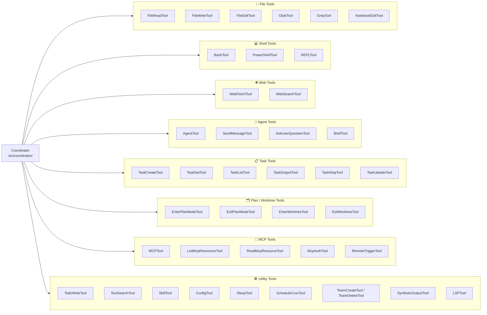
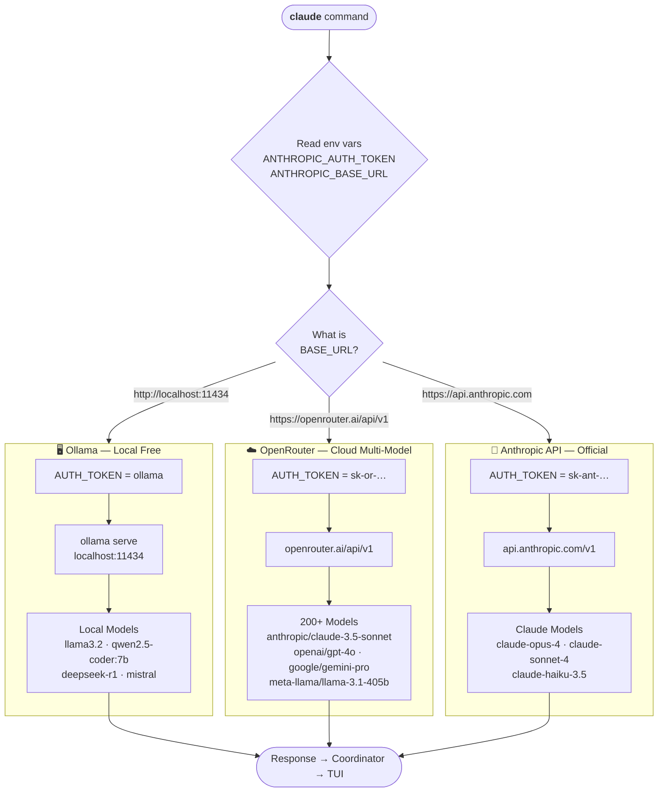
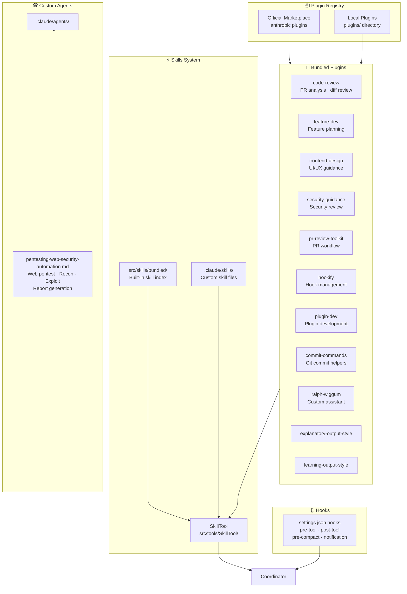

# Claude Code

 [![npm]](https://www.npmjs.com/package/@anthropic-ai/claude-code)   

[npm]: https://img.shields.io/npm/v/@anthropic-ai/claude-code.svg?style=flat-square

> **This is a personal fork** of [Anthropic's Claude Code](https://github.com/anthropics/claude-code) by [@lily0ng](https://github.com/lily0ng), extended to support local models via **Ollama** and cloud models via **OpenRouter** — with no Anthropic API billing required. All core functionality, architecture, and intellectual property belongs to [Anthropic](https://anthropic.com). This fork is not affiliated with or endorsed by Anthropic.

Claude Code is an agentic coding tool that lives in your terminal, understands your codebase, and helps you code faster by executing routine tasks, explaining complex code, and handling git workflows — all through natural language commands.

**Learn more in the [official documentation](https://code.claude.com/docs/en/overview)** · **Original repo: [anthropics/claude-code](https://github.com/anthropics/claude-code)**


---

## Architecture

### 1 · Claude Code Architecture Diagram

> Full component map derived from `src/` — shows how the CLI, coordinator, tools, services, and UI layer connect.



---

### 2 · System Design — Request Flow

> Sequence of events from a user prompt to a model response, including tool execution loops.



---

### 3 · Tool System Architecture

> All 30+ tools grouped by category, from `src/tools/`.



---

### 4 · Backend Model Routing (This Fork)

> How `ANTHROPIC_BASE_URL` routes Claude Code to different model backends.



---

### 5 · Plugin & Skills System

> Plugin architecture from `plugins/` and `src/skills/`, including the custom agent in `.claude/agents/`.



---

## Get started

> [!NOTE]
> This fork runs against **Ollama** (local, free) or **OpenRouter** (cloud). The standard Anthropic API setup still works — see [official setup docs](https://code.claude.com/docs/en/setup).

### Install Claude Code (upstream CLI)

**macOS / Linux (Recommended):**
```bash
curl -fsSL https://claude.ai/install.sh | bash
```

**Homebrew (macOS / Linux):**
```bash
brew install --cask claude-code
```

**Windows (Recommended):**
```powershell
irm https://claude.ai/install.ps1 | iex
```

**NPM (Deprecated):**
```bash
npm install -g @anthropic-ai/claude-code
```

Navigate to your project and run `claude`.

---

## Running with local models (this fork)

### Ollama (local, free, offline)

> Requires **Ollama v0.14.0+** and **Claude Code v2.1.12+**

```bash
# 1. Install Ollama
brew install ollama          # macOS
# or: curl -fsSL https://ollama.com/install.sh | sh

# 2. Pull a model
ollama pull llama3.2
ollama pull qwen2.5-coder:7b   # better for code tasks

# 3. Start server + launch
ollama serve &
ANTHROPIC_AUTH_TOKEN=ollama \
ANTHROPIC_BASE_URL=http://localhost:11434 \
claude --model llama3.2
```

**Persistent setup** — add to `~/.zshrc`:
```bash
export ANTHROPIC_AUTH_TOKEN="ollama"
export ANTHROPIC_BASE_URL="http://localhost:11434"
```

**npm shortcuts:**
```bash
npm run setup   # pull llama3.2
npm run dev     # launch with Ollama
```

---

### OpenRouter (cloud, multi-model)

```bash
ANTHROPIC_AUTH_TOKEN=your-openrouter-key \
ANTHROPIC_BASE_URL=https://openrouter.ai/api/v1 \
claude --model anthropic/claude-3.5-sonnet
```

Get your key at [openrouter.ai/keys](https://openrouter.ai/keys) · browse models at [openrouter.ai/models](https://openrouter.ai/models).

---

## Fork changes vs upstream

| | [anthropics/claude-code](https://github.com/anthropics/claude-code) | [lily0ng/claude-code](https://github.com/lily0ng/claude-code) |
|---|---|---|
| Backend | Anthropic API only | Ollama · OpenRouter · Anthropic API |
| Billing | Pay-per-token | Free (local) / OpenRouter pricing |
| Offline | ✗ | ✓ via Ollama |
| Theme | Default blue | vxrt red/black (`/theme → vxrt`) |
| Agents | — | pentesting-web-security-automation |

---

## npm scripts

| Command | Description |
|---|---|
| `npm run dev` | Launch claude via Ollama (llama3.2) |
| `npm run start` | Launch claude via Ollama (default model) |
| `npm run setup` | Pull llama3.2 model |
| `npm run ollama:serve` | Start Ollama server |
| `npm run ollama:list` | List local models |
| `npm run openrouter` | Launch claude (reads env vars) |

---

## Plugins

Bundled plugins in `plugins/` extend Claude Code with custom slash commands and agents:

| Plugin | Purpose |
|---|---|
| `code-review` | PR diff analysis |
| `feature-dev` | Feature planning workflow |
| `frontend-design` | UI/UX guidance |
| `security-guidance` | Security review |
| `pr-review-toolkit` | Full PR review workflow |
| `hookify` | Hook configuration |
| `commit-commands` | Git commit helpers |

See the [plugins directory](./plugins/) for full documentation.

---

## Branches

| Branch | Purpose |
|---|---|
| `main` | Stable release |
| `dev` | Development / integration |
| `feat/ollama-integration` | Local Ollama backend |
| `feat/openrouter-integration` | OpenRouter cloud backend |
| `feat/themes` | Custom vxrt theme |
| `feat/ui-branding` | UI patches |

---

## Community & support (upstream)

- 📖 [Official docs](https://code.claude.com/docs/en/overview)
- 💬 [Claude Developers Discord](https://anthropic.com/discord)
- 🐛 [Report bugs](https://github.com/anthropics/claude-code/issues) — use `/bug` inside Claude Code
- 📦 [npm package](https://www.npmjs.com/package/@anthropic-ai/claude-code)

---

## Credits & attribution

This fork exists thanks to the exceptional work of the Anthropic team. Full credit for the core product, architecture, and design belongs to them.

- **Original project**: [Claude Code](https://github.com/anthropics/claude-code) by [Anthropic](https://anthropic.com)
- **Original authors**: The Claude Code team at Anthropic — see [CHANGELOG.md](./CHANGELOG.md) for full history
- **License**: [See LICENSE.md](./LICENSE.md) — this fork inherits the upstream license
- **Local model runtime**: [Ollama](https://ollama.com)
- **Cloud model routing**: [OpenRouter](https://openrouter.ai)
- **Fork maintainer**: [@lily0ng](https://github.com/lily0ng)

> Claude Code and the Claude name are trademarks of Anthropic, PBC. This fork is an independent, unofficial project.
