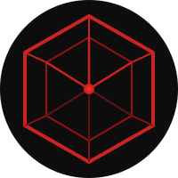
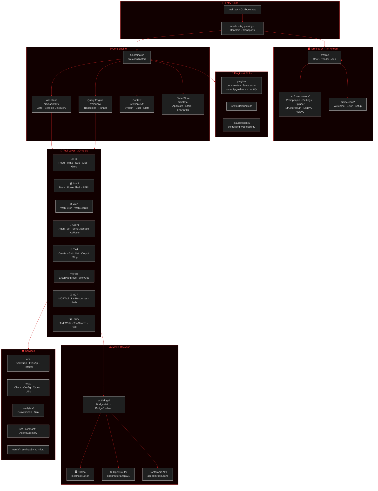
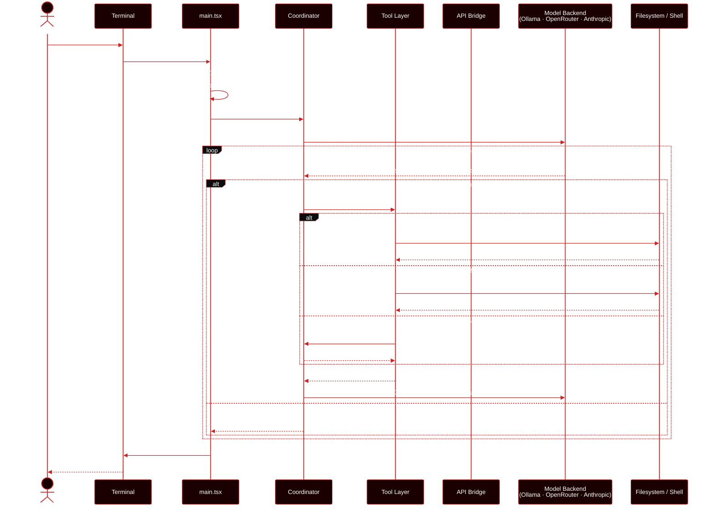
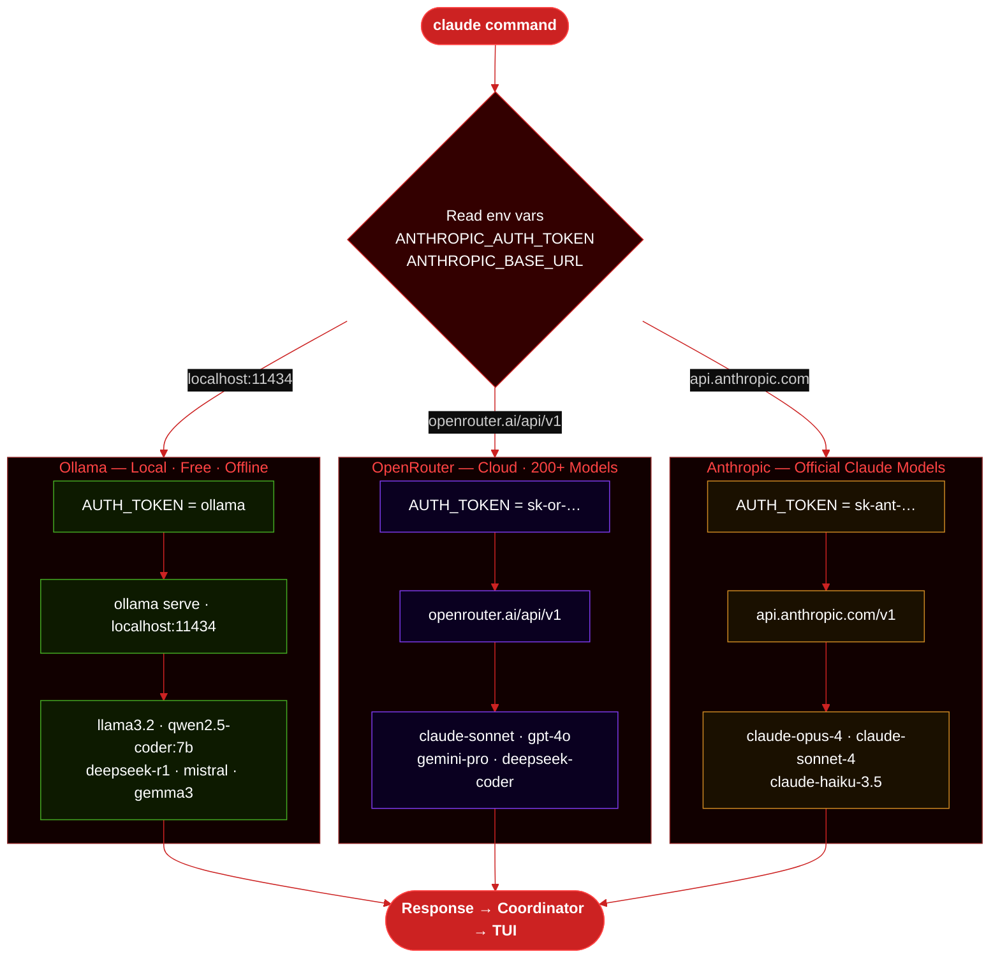
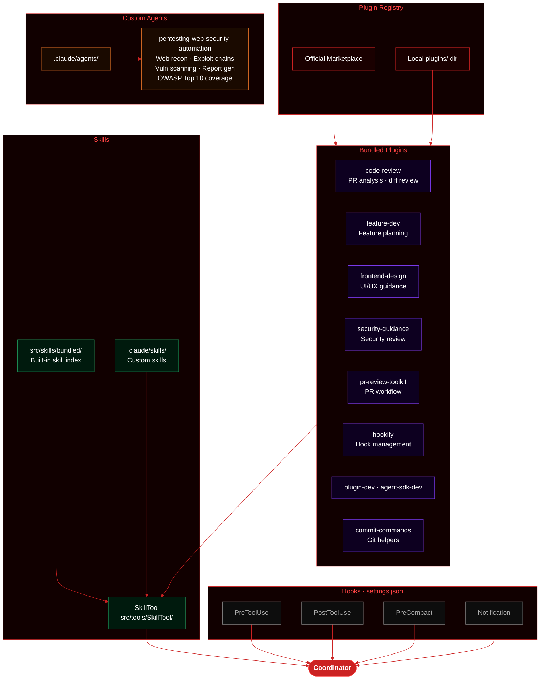

<div align="center">
  
  <h1>Claude Code</h1>
  <p><em>Fork · Local Models · No API Billing</em></p>

  <!-- Row 1 -->
  <a href="https://nodejs.org"></a>
  <a href="https://www.npmjs.com/package/@anthropic-ai/claude-code"></a>
  <a href="https://github.com/lily0ng/claude-code"></a>
  <a href="https://github.com/anthropics/claude-code"></a>
  <br/>
  <!-- Row 2 -->
  <a href="https://ollama.com"></a>
  <a href="https://openrouter.ai"></a>
  <a href="https://github.com/0xff0ay"></a>
  <a href="https://github.com/lily0ng/claude-code/blob/main/LICENSE.md"></a>
</div>

---

> **This is a personal fork** of [Anthropic's Claude Code](https://github.com/anthropics/claude-code) by [@lily0ng](https://github.com/lily0ng), extended to support local models via **Ollama** and cloud models via **OpenRouter** — no Anthropic API billing required. All core functionality and IP belongs to [Anthropic](https://anthropic.com). This fork is not affiliated with or endorsed by Anthropic.

Claude Code is an agentic coding tool that lives in your terminal, understands your codebase, and helps you code faster through natural language commands — file editing, shell execution, git workflows, and multi-agent tasks.

**[Official Docs](https://code.claude.com/docs/en/overview)** · **[Upstream Repo](https://github.com/anthropics/claude-code)** · **[npm](https://www.npmjs.com/package/@anthropic-ai/claude-code)** · **[OpenRouter Models](https://openrouter.ai/models)**


---

## Features

### Supported

| Feature | Description | Status |
|---|---|:---:|
| Natural language coding | Ask in plain English — claude reads, writes and edits code | ✅ |
| File read / write / edit | Full filesystem access via FileReadTool, FileWriteTool, FileEditTool | ✅ |
| Code search | GlobTool and GrepTool — find files and patterns across the repo | ✅ |
| Shell execution | Run any bash/shell command via BashTool | ✅ |
| Git workflow | Commit, diff, branch, PR — all git operations via shell | ✅ |
| Agentic sub-agents | AgentTool spawns parallel sub-agents for complex multi-step tasks | ✅ |
| Task management | Create, list, stop and get output from async tasks | ✅ |
| Todo tracking | TodoWriteTool — persistent task lists per session | ✅ |
| Plan mode | Enter plan-first mode before executing changes | ✅ |
| Worktree isolation | Git worktree support — EnterWorktreeTool / ExitWorktreeTool | ✅ |
| MCP servers | Connect external tools via Model Context Protocol | ✅ |
| Plugins | Slash-command plugins: code-review, feature-dev, security-guidance | ✅ |
| Skills | Custom skill files loaded at session start | ✅ |
| Custom agents | `.claude/agents/` — domain-specific agent definitions | ✅ |
| Web fetch | Fetch and read URLs via WebFetchTool | ✅ |
| Web search | Search the web via WebSearchTool | ✅ |
| Notebook editing | Jupyter notebook cell editing via NotebookEditTool | ✅ |
| Custom theme | vxrt red/black theme — `/theme → vxrt` | ✅ |
| Offline mode | Full local operation with no internet needed (Ollama) | ✅ |
| No billing | Free with Ollama / pay-as-you-go with OpenRouter | ✅ |

### Not Supported / Limited

| Feature | Reason | Status |
|---|---|:---:|
| Anthropic OAuth login | Requires Anthropic account — not needed with Ollama or OpenRouter | ❌ |
| Usage billing dashboard | Anthropic-only — use OpenRouter dashboard for cloud spend tracking | ❌ |
| Extended thinking | Claude-specific capability — unavailable on local models | ❌ |
| Vision / image input | Model-dependent — llama3.2 does not support image input | ⚠️ |
| Auto model updates | Tied to Anthropic release channel — manual `ollama pull` required | ⚠️ |
| Remote teleport sessions | Requires Anthropic infrastructure | ❌ |
| Claude.ai account sync | Tied to Anthropic account system | ❌ |
| Prompt caching | Anthropic API optimization — not applicable to Ollama | ❌ |
| Deep research mode | Claude-specific capability | ❌ |
| GitHub app integration | Requires Anthropic-signed GitHub app | ❌ |

---

## Supported Models

### Ollama — Local Free Models

| Model | Size | Best For | Command |
|---|---|---|---|
| `llama3.2` ⭐ | 2.0 GB | General coding, quick tasks | `ollama pull llama3.2` |
| `qwen2.5-coder:7b` 🏆 | 4.7 GB | **Recommended — coding** | `ollama pull qwen2.5-coder:7b` |
| `qwen2.5-coder:14b` 🔥 | 9.0 GB | **Best mid-range coding** | `ollama pull qwen2.5-coder:14b` |
| `qwen2.5-coder:32b` 💪 | 19 GB | Maximum local quality | `ollama pull qwen2.5-coder:32b` |
| `deepseek-coder-v2` | 8.9 GB | Code completion | `ollama pull deepseek-coder-v2` |
| `deepseek-r1:7b` | 4.7 GB | Reasoning + code | `ollama pull deepseek-r1:7b` |
| `codellama:13b` | 7.4 GB | Code focused | `ollama pull codellama:13b` |
| `mistral:7b` | 4.1 GB | Fast general purpose | `ollama pull mistral:7b` |
| `gemma3:9b` | 5.4 GB | Google general purpose | `ollama pull gemma3:9b` |
| `phi4:14b` | 9.1 GB | Microsoft reasoning | `ollama pull phi4:14b` |

> **Currently installed:** `llama3.2:latest` (2.0 GB)

### OpenRouter — Cloud Models

| Model | Best For | Speed | Cost |
|---|---|---|---|
| `anthropic/claude-sonnet-4-5` 🏆 | Best overall coding | Medium | $$$ |
| `anthropic/claude-3.5-haiku` | Fast coding tasks | Fast | $$ |
| `deepseek/deepseek-coder` 🔥 | Best free coding tier | Fast | Free |
| `qwen/qwen-2.5-coder-32b-instruct` | Large code tasks | Medium | $ |
| `openai/gpt-4o` | General purpose | Fast | $$$ |
| `google/gemini-pro-1.5` | Long context tasks | Medium | $$ |
| `meta-llama/llama-3.1-405b-instruct` | Large reasoning | Slow | $$ |
| `mistralai/mistral-large` | Code + reasoning | Medium | $$ |

### Model Recommendations

```
Best quality (cloud)   →  anthropic/claude-sonnet-4-5
Best free (cloud)      →  deepseek/deepseek-coder
Best local fast        →  qwen2.5-coder:7b     (needs ~6GB RAM)
Best local quality     →  qwen2.5-coder:32b    (needs ~22GB RAM)
Currently installed    →  llama3.2             (ready, 2GB)
```

---

## How to Run

### Requirements

| Tool | Min Version | Check |
|---|---|---|
| Claude Code CLI | 2.1.12 | `claude --version` |
| Ollama | 0.14.0 | `ollama --version` |
| Node.js | 18.0.0 | `node --version` |

---

### Step 1 — Install Claude Code CLI

```bash
# macOS / Linux
curl -fsSL https://claude.ai/install.sh | bash

# macOS via Homebrew
brew install --cask claude-code

# Windows (PowerShell)
irm https://claude.ai/install.ps1 | iex

# Verify
claude --version   # expect ≥ 2.1.12
```

---

### Step 2A — Ollama (Local, Free, Offline)

```bash
# Install Ollama
brew install ollama                      # macOS
curl -fsSL https://ollama.com/install.sh | sh  # Linux

# Pull a model
ollama pull llama3.2                     # 2 GB  — quick start
ollama pull qwen2.5-coder:7b             # 4.7 GB — recommended for code

# Start server (keep this running)
ollama serve

# Launch in a new terminal
ANTHROPIC_AUTH_TOKEN=ollama \
ANTHROPIC_BASE_URL=http://localhost:11434 \
claude --model llama3.2
```

**Make it permanent** — add to `~/.zshrc` or `~/.bashrc`:

```bash
export ANTHROPIC_AUTH_TOKEN="ollama"
export ANTHROPIC_BASE_URL="http://localhost:11434"
```

Then just:
```bash
ollama serve &
claude --model llama3.2
```

---

### Step 2B — OpenRouter (Cloud, 200+ Models)

```bash
# Get your key at: https://openrouter.ai/keys

ANTHROPIC_AUTH_TOKEN=your-openrouter-key \
ANTHROPIC_BASE_URL=https://openrouter.ai/api/v1 \
claude --model anthropic/claude-3.5-sonnet
```

**Persistent setup:**
```bash
export ANTHROPIC_AUTH_TOKEN="sk-or-your-key"
export ANTHROPIC_BASE_URL="https://openrouter.ai/api/v1"
```

---

### Step 2C — Anthropic API (Official)

```bash
export ANTHROPIC_API_KEY="sk-ant-your-key"
claude
```

---

### npm Shortcuts

```bash
npm run setup          # pull llama3.2 model
npm run dev            # launch with Ollama + llama3.2
npm run start          # launch with Ollama (default model)
npm run ollama:serve   # start Ollama server
npm run ollama:list    # list downloaded models
npm run openrouter     # launch with OpenRouter (reads env vars)
```

---

### Verify Connection

Inside claude, run:
```
/status
```

Expected output for Ollama:
```
Auth token:         ollama
Anthropic base URL: http://localhost:11434
Model:              llama3.2
```

Then apply the vxrt theme:
```
/theme → select vxrt
```

---

## Architecture

### 1 · Claude Code — Component Architecture



---

### 2 · System Design — Request Flow



---

### 3 · Tool System — Category Map


---

### 4 · Backend Model Routing



---

### 5 · Plugin & Skills System



---

## Fork changes vs upstream

| | [anthropics/claude-code](https://github.com/anthropics/claude-code) | [lily0ng/claude-code](https://github.com/lily0ng/claude-code) |
|---|---|---|
| Backend | Anthropic API only | Ollama · OpenRouter · Anthropic API |
| Billing | Pay-per-token | Free (local) / OpenRouter pricing |
| Offline | No | Yes — via Ollama |
| Theme | Default blue | vxrt red/black |
| Custom agents | None | pentesting-web-security-automation |
| Branding | Claude Code | vxrt code |

---

## Plugins

| Plugin | Purpose |
|---|---|
| `code-review` | PR diff analysis and inline review |
| `feature-dev` | Feature planning and development workflow |
| `frontend-design` | UI/UX guidance and component generation |
| `security-guidance` | Security review and vulnerability hardening |
| `pr-review-toolkit` | Full pull request review workflow |
| `hookify` | Hook configuration and management |
| `commit-commands` | Git commit message helpers |
| `agent-sdk-dev` | Agent SDK development assistance |

---

## Branches

| Branch | Purpose |
|---|---|
| `main` | Stable release |
| `dev` | Development / integration |
| `feat/ollama-integration` | Local Ollama backend |
| `feat/openrouter-integration` | OpenRouter cloud backend |
| `feat/themes` | Custom vxrt theme |
| `feat/ui-branding` | UI patches |

---

## Contributors

<table>
  <tr>
    <td align="center" width="200">
      <a href="https://github.com/lily0ng">
        
        <br/><b>lily0ng</b>
      </a>
      <br/>
      <sub>Fork Maintainer</sub><br/>
      <sub>Config · Integration · Theming</sub><br/>
      <sub>
        <a href="https://github.com/lily0ng">GitHub</a> ·
        <a href="https://github.com/lily0ng/claude-code">claude-code</a>
      </sub>
    </td>
    <td align="center" width="200">
      <a href="https://github.com/0xff0ay">
        
        <br/><b>0xff0ay</b>
      </a>
      <br/>
      <sub>Senior Offensive Security Engineer ( Hacker )</sub><br/>
      <sub>Zero Day Researcher · VXRT, USA</sub><br/>
      <sub>
        <a href="https://github.com/0xff0ay">GitHub</a> ·
        <a href="https://github.com/0xff0ay/Offensive-Security">Offensive-Security</a> ·
        <a href="https://github.com/0xff0ay/HTB">HTB</a>
      </sub>
    </td>
  </tr>
</table>

---

## Collaborators

| Handle | Role | Repos |
|---|---|---|
| [@lily0ng](https://github.com/lily0ng) | Fork Maintainer · Config & Integration | [claude-code](https://github.com/lily0ng/claude-code) |
| [@0xff0ay](https://github.com/0xff0ay) | Senior Offensive Security Engineer ( Hacker ) · Zero Day Researcher · VXRT, USA | [Offensive-Security](https://github.com/0xff0ay/Offensive-Security) · [HTB](https://github.com/0xff0ay/HTB) · [0xff](https://github.com/0xff0ay/0xff) |

---

## About This Fork

This fork was created to make Claude Code usable without an Anthropic account or API billing. The primary goal is to route all AI inference through local Ollama models (free, offline, private) or OpenRouter (cloud, flexible pricing) instead of the Anthropic API.

The codebase is Anthropic's proprietary source — the `src/` directory contains the full TypeScript/TSX source that compiles into the `claude` binary. This fork does not redistribute the compiled binary; it configures the existing installed CLI to route to alternative backends.

**Why this matters:**
- Run a full agentic coding assistant with zero ongoing cost
- Keep code and prompts private — nothing leaves your machine with Ollama
- Access 200+ models via OpenRouter with a single API key
- Use specialized coding models like `qwen2.5-coder` for better code quality

---

## License

This fork inherits the upstream license. See [LICENSE.md](./LICENSE.md).

Original work © Anthropic, PBC. Fork modifications by [@lily0ng](https://github.com/lily0ng).

> Claude Code and the Claude name are trademarks of Anthropic, PBC. This fork is an independent, unofficial project not affiliated with or endorsed by Anthropic.
