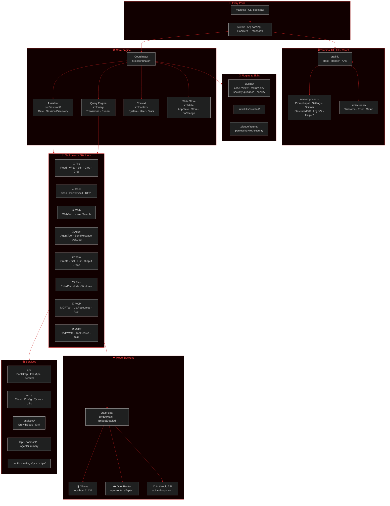
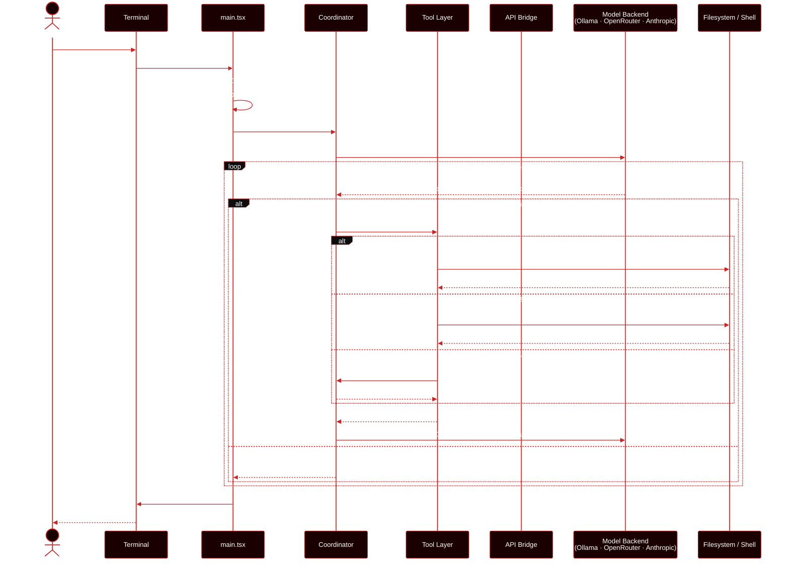
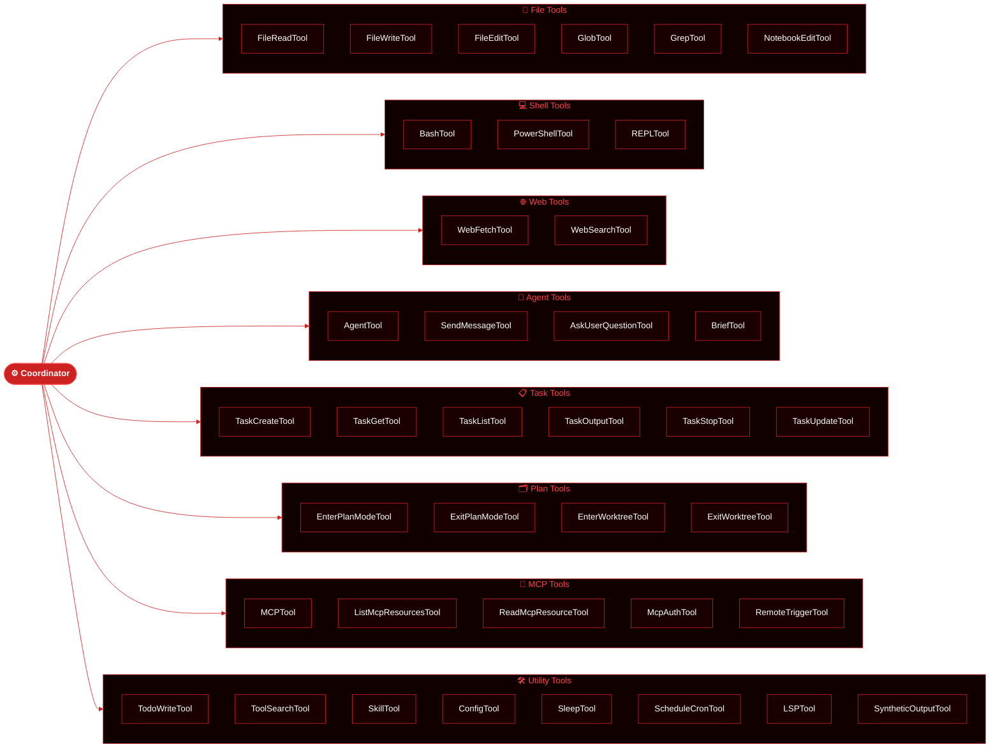
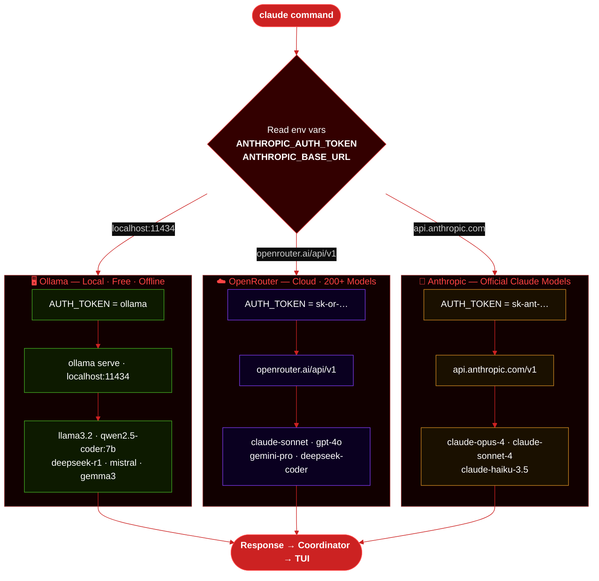
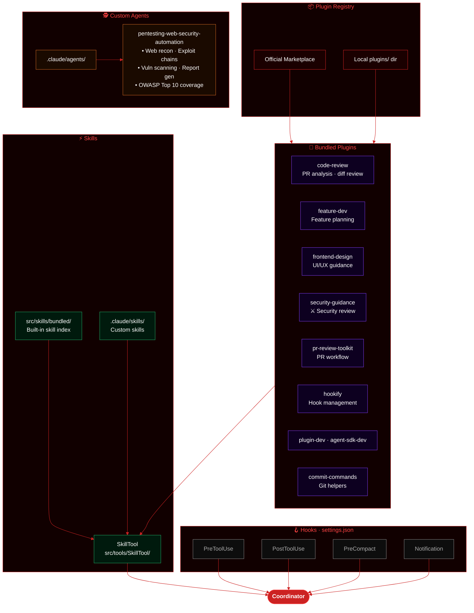

<div align="center">
  
  <h1>Claude Code</h1>
  <p><em>Fork · Local Models · No API Billing</em></p>

  
  [](https://www.npmjs.com/package/@anthropic-ai/claude-code)
  
  
  
  
</div>

---

> **This is a personal fork** of [Anthropic's Claude Code](https://github.com/anthropics/claude-code) by [@lily0ng](https://github.com/lily0ng), extended to support local models via **Ollama** and cloud models via **OpenRouter** — no Anthropic API billing required. All core functionality and IP belongs to [Anthropic](https://anthropic.com). This fork is not affiliated with or endorsed by Anthropic.

Claude Code is an agentic coding tool that lives in your terminal, understands your codebase, and helps you code faster through natural language commands.

**[Official Docs](https://code.claude.com/docs/en/overview)** · **[Upstream Repo](https://github.com/anthropics/claude-code)** · **[npm](https://www.npmjs.com/package/@anthropic-ai/claude-code)**


---

## Features

### ✅ Supported in this fork

| Feature | Description |
|---|---|
| 🧠 Natural language coding | Ask in plain English — claude reads and edits your code |
| 📁 File read / write / edit | Full file system access via `FileReadTool`, `FileWriteTool`, `FileEditTool` |
| 🔍 Code search | `GlobTool` + `GrepTool` — find files and patterns across the repo |
| 💻 Shell execution | Run any bash/shell command via `BashTool` |
| 🔀 Git workflow | Commit, diff, branch, PR — git operations via shell |
| 🤖 Agentic sub-agents | `AgentTool` spawns parallel sub-agents for complex tasks |
| 📋 Task management | Create, list, stop tasks — full `TaskTool` suite |
| 📝 Todo tracking | `TodoWriteTool` — persistent task lists per session |
| 🗂 Plan mode | Enter plan-first mode before executing (`EnterPlanModeTool`) |
| 🌿 Worktree support | Git worktree isolation (`EnterWorktreeTool`) |
| 🔌 MCP servers | Connect external tools via Model Context Protocol |
| 🧩 Plugins | Slash-command plugins: code-review, feature-dev, security-guidance |
| ⚡ Skills | Custom skill files loaded at session start |
| 🕵️ Custom agents | `.claude/agents/` — domain-specific agent definitions |
| 🌐 Web fetch | `WebFetchTool` — fetch URLs (model-dependent) |
| 🔎 Web search | `WebSearchTool` — search the web (model-dependent) |
| 🎨 Custom theme | vxrt red/black theme (`/theme → vxrt`) |
| 📓 Notebook editing | Jupyter notebook cell editing via `NotebookEditTool` |
| 🖥 Offline mode | Full local operation — no internet needed (Ollama) |
| 🔒 No billing | Free with Ollama / OpenRouter pay-as-you-go |

### ❌ Not supported / limited in this fork

| Feature | Reason |
|---|---|
| 🔑 Anthropic OAuth login | Requires Anthropic account — not needed for Ollama/OpenRouter |
| 💳 Usage billing dashboard | Anthropic-only; use OpenRouter dashboard instead |
| 🧠 Extended thinking | Claude-specific feature — not available on local models |
| 👁 Vision / image input | Depends on model — llama3.2 does not support images |
| 🔄 Auto model updates | Upstream Anthropic release channel — manual pull needed |
| ☁️ Remote teleport sessions | Requires Anthropic infrastructure |
| 🔗 Claude.ai account sync | Tied to Anthropic account |
| ⚡ Prompt caching | Anthropic API optimization — not applicable to Ollama |
| 📊 Deep research mode | Claude-specific capability |
| 🤝 GitHub app integration | Requires Anthropic-signed GitHub app |

---

## Supported Models

### Ollama — Local Free Models

| Model | Size | Best For | Install |
|---|---|---|---|
| `llama3.2` ⭐ | 2 GB | General coding, chat | `ollama pull llama3.2` |
| `qwen2.5-coder:7b` 🏆 | 4.7 GB | **Recommended: coding** | `ollama pull qwen2.5-coder:7b` |
| `qwen2.5-coder:14b` 🔥 | 9 GB | **Best local coding** | `ollama pull qwen2.5-coder:14b` |
| `qwen2.5-coder:32b` 💪 | 19 GB | Maximum local quality | `ollama pull qwen2.5-coder:32b` |
| `deepseek-coder-v2` | 8.9 GB | Code completion | `ollama pull deepseek-coder-v2` |
| `deepseek-r1:7b` | 4.7 GB | Reasoning + code | `ollama pull deepseek-r1:7b` |
| `codellama:13b` | 7.4 GB | Code focused | `ollama pull codellama:13b` |
| `mistral:7b` | 4.1 GB | Fast general purpose | `ollama pull mistral:7b` |
| `gemma3:9b` | 5.4 GB | Google general purpose | `ollama pull gemma3:9b` |
| `phi4:14b` | 9.1 GB | Microsoft reasoning | `ollama pull phi4:14b` |

> **Currently installed:** `llama3.2:latest` (2.0 GB)

### OpenRouter — Cloud Models

| Model | Best For | Speed | Cost |
|---|---|---|---|
| `anthropic/claude-sonnet-4-5` 🏆 | **Best overall coding** | Medium | $$$ |
| `anthropic/claude-3.5-haiku` ⚡ | Fast coding tasks | Fast | $$ |
| `deepseek/deepseek-coder` 🔥 | **Best free coding** | Fast | Free tier |
| `qwen/qwen-2.5-coder-32b-instruct` | Large code tasks | Medium | $ |
| `openai/gpt-4o` | General purpose | Fast | $$$ |
| `google/gemini-pro-1.5` | Long context | Medium | $$ |
| `meta-llama/llama-3.1-405b-instruct` | Large tasks | Slow | $$ |
| `mistralai/mistral-large` | Code + reasoning | Medium | $$ |

### Recommended for Coding Tasks

```
🏆 Best quality (cloud):  anthropic/claude-sonnet-4-5
🔥 Best free (cloud):     deepseek/deepseek-coder
⚡ Best local fast:        qwen2.5-coder:7b
💪 Best local quality:    qwen2.5-coder:32b  (needs 20GB RAM)
🖥 Currently running:     llama3.2  (installed, ready)
```

---

## How to Run

### Requirements

| Tool | Version | Check |
|---|---|---|
| Claude Code CLI | ≥ 2.1.12 | `claude --version` |
| Ollama | ≥ 0.14.0 | `ollama --version` |
| Node.js | ≥ 18.0.0 | `node --version` |
| Bun (optional) | ≥ 1.0 | `bun --version` |

---

### Step 1 — Install Claude Code CLI

```bash
# macOS / Linux
curl -fsSL https://claude.ai/install.sh | bash

# macOS (Homebrew)
brew install --cask claude-code

# Windows
irm https://claude.ai/install.ps1 | iex

# Verify
claude --version   # should show ≥ 2.1.12
```

---

### Step 2A — Run with Ollama (Local, Free)

```bash
# Install Ollama
brew install ollama          # macOS
# Linux: curl -fsSL https://ollama.com/install.sh | sh

# Pull a model (pick one)
ollama pull llama3.2                 # 2GB  — quick start
ollama pull qwen2.5-coder:7b         # 4.7GB — recommended for code
ollama pull deepseek-r1:7b           # 4.7GB — reasoning

# Start Ollama server (keep this terminal open)
ollama serve

# In a new terminal — launch vxrt code
ANTHROPIC_AUTH_TOKEN=ollama \
ANTHROPIC_BASE_URL=http://localhost:11434 \
claude --model llama3.2
```

**Make it permanent** — add to `~/.zshrc` or `~/.bashrc`:
```bash
export ANTHROPIC_AUTH_TOKEN="ollama"
export ANTHROPIC_BASE_URL="http://localhost:11434"
```
Then just:
```bash
ollama serve &          # start server in background
claude --model llama3.2 # or: npm run dev
```

---

### Step 2B — Run with OpenRouter (Cloud)

```bash
# 1. Get API key at: https://openrouter.ai/keys

# 2. Launch
ANTHROPIC_AUTH_TOKEN=your-openrouter-key \
ANTHROPIC_BASE_URL=https://openrouter.ai/api/v1 \
claude --model anthropic/claude-3.5-sonnet
```

**Make it permanent:**
```bash
export ANTHROPIC_AUTH_TOKEN="sk-or-your-key-here"
export ANTHROPIC_BASE_URL="https://openrouter.ai/api/v1"
```

---

### Step 2C — Run with Anthropic API (Official)

```bash
export ANTHROPIC_API_KEY="sk-ant-your-key-here"
claude   # uses claude-sonnet by default
```

---

### npm Shortcuts

```bash
npm run setup         # pull llama3.2 model
npm run dev           # launch with Ollama + llama3.2
npm run start         # launch with Ollama (default model)
npm run ollama:serve  # start Ollama server
npm run ollama:list   # list downloaded models
npm run openrouter    # launch with OpenRouter (reads ANTHROPIC_* env)
```

---

### Verify connection

Once running, inside claude:
```
/status    → check model, base URL, auth token
/model     → switch model
/theme     → select vxrt (red/black theme)
```

Expected `/status` output for Ollama:
```
Auth token:         ollama
Anthropic base URL: http://localhost:11434
Model:              llama3.2
```

---

## Architecture

### 1 · Claude Code — Component Architecture



---

### 2 · System Design — Request Flow



---

### 3 · Tool System — Category Map



---

### 4 · Backend Model Routing



---

### 5 · Plugin & Skills System



---

## Fork changes vs upstream

| | [anthropics/claude-code](https://github.com/anthropics/claude-code) | [lily0ng/claude-code](https://github.com/lily0ng/claude-code) |
|---|---|---|
| Backend | Anthropic API only | Ollama · OpenRouter · Anthropic API |
| Billing | Pay-per-token | Free (local) / OpenRouter pricing |
| Offline | ✗ | ✓ via Ollama |
| Theme | Default blue | vxrt red/black (`/theme → vxrt`) |
| Agents | — | pentesting-web-security-automation |

---

## Plugins

| Plugin | Purpose |
|---|---|
| `code-review` | PR diff analysis |
| `feature-dev` | Feature planning workflow |
| `frontend-design` | UI/UX guidance |
| `security-guidance` | Security review & hardening |
| `pr-review-toolkit` | Full PR review workflow |
| `hookify` | Hook configuration |
| `commit-commands` | Git commit helpers |
| `agent-sdk-dev` | Agent SDK development |

---

## Branches

| Branch | Purpose |
|---|---|
| `main` | Stable release |
| `dev` | Development / integration |
| `feat/ollama-integration` | Local Ollama backend |
| `feat/openrouter-integration` | OpenRouter cloud backend |
| `feat/themes` | Custom vxrt theme |
| `feat/ui-branding` | UI patches |

---

## Contributors

<table>
  <tr>
    <td align="center">
      <a href="https://github.com/lily0ng">
        <br/>
        <sub><b>lily0ng</b></sub>
      </a><br/>
      <sub>Fork Maintainer<br/>Config &amp; Integration</sub>
    </td>
    <td align="center">
      <a href="https://github.com/0xff0ay">
        <br/>
        <sub><b>0xff0ay</b></sub>
      </a><br/>
      <sub>Senior Offensive Security Engineer ( Hacker )<br/>Zero Day Researcher · VXRT, USA</sub>
    </td>
  </tr>
</table>

---

## Collaborators

| Handle | Role | Links |
|---|---|---|
| [@lily0ng](https://github.com/lily0ng) | Fork Maintainer · Integration | [GitHub](https://github.com/lily0ng) |
| [@0xff0ay](https://github.com/0xff0ay) | Senior Offensive Security Engineer ( Hacker ) · Zero Day Researcher · VXRT, USA | [GitHub](https://github.com/0xff0ay) · [Offensive-Security](https://github.com/0xff0ay/Offensive-Security) · [HTB](https://github.com/0xff0ay/HTB) |

---

## Community & support

- 📖 [Official docs](https://code.claude.com/docs/en/overview)
- 💬 [Claude Developers Discord](https://anthropic.com/discord)
- 🐛 [Report upstream bugs](https://github.com/anthropics/claude-code/issues)
- 📦 [npm package](https://www.npmjs.com/package/@anthropic-ai/claude-code)

---

## Credits & attribution

- **Original project**: [Claude Code](https://github.com/anthropics/claude-code) by [Anthropic](https://anthropic.com)
- **Original authors**: The Claude Code team at Anthropic — see [CHANGELOG.md](./CHANGELOG.md)
- **License**: [LICENSE.md](./LICENSE.md) — this fork inherits the upstream license
- **Local runtime**: [Ollama](https://ollama.com)
- **Cloud routing**: [OpenRouter](https://openrouter.ai)
- **Fork maintainer**: [@lily0ng](https://github.com/lily0ng)
- **Security contributor**: [@0xff0ay](https://github.com/0xff0ay) — Senior Offensive Security Engineer ( Hacker ) · Zero Day Researcher · VXRT, USA

> Claude Code and the Claude name are trademarks of Anthropic, PBC. This fork is an independent, unofficial project.
