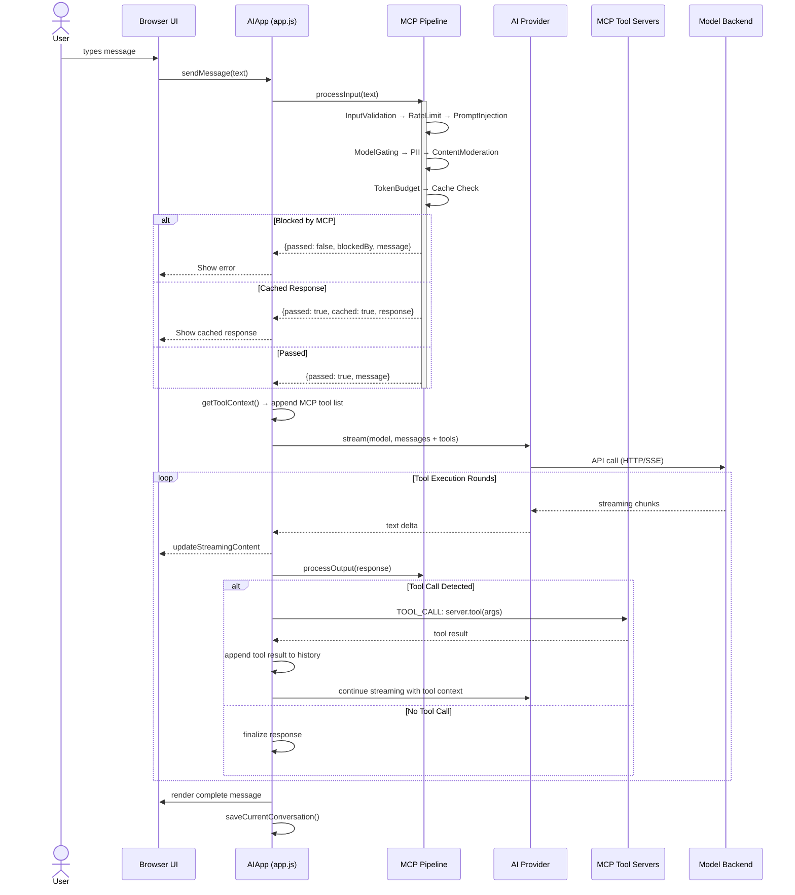
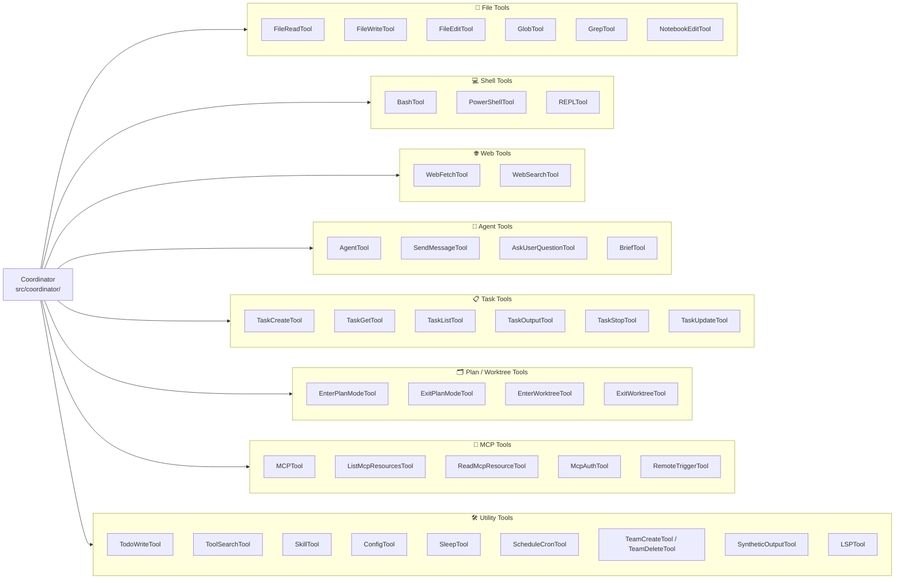
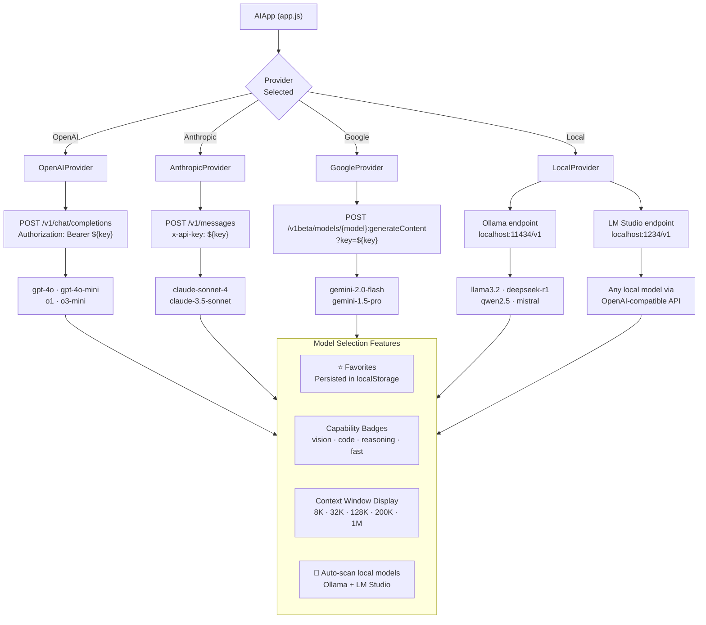
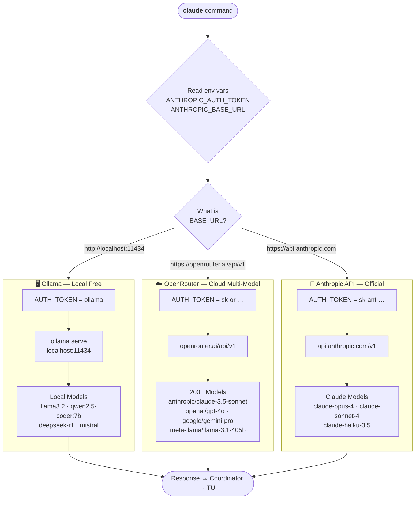
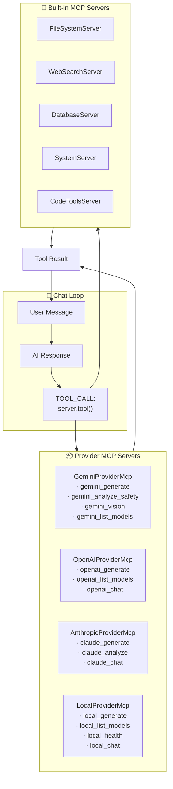
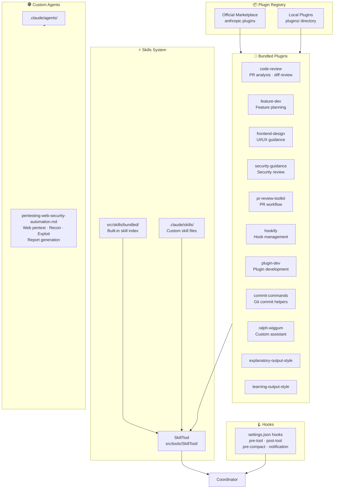

# Claude Code + AI Platform

 [![npm]](https://www.npmjs.com/package/@anthropic-ai/claude-code)    

[npm]: https://img.shields.io/npm/v/@anthropic-ai/claude-code.svg?style=flat-square

> **This is a personal fork** of [Anthropic's Claude Code](https://github.com/anthropics/claude-code) by [@lily0ng](https://github.com/lily0ng), extended with a **browser-based AI Platform UI**, local models via **Ollama** and **LM Studio**, cloud models via **OpenRouter** and **direct API providers** — with no Anthropic API billing required. All core functionality, architecture, and intellectual property belongs to [Anthropic](https://anthropic.com). This fork is not affiliated with or endorsed by Anthropic.

Claude Code is an agentic coding tool that lives in your terminal, understands your codebase, and helps you code faster by executing routine tasks, explaining complex code, and handling git workflows — all through natural language commands. The **AI Platform** is a companion browser UI that provides a visual interface to multiple AI providers, MCP security pipelines, and tool servers.

**Learn more in the [official documentation](https://code.claude.com/docs/en/overview)** · **Original repo: [anthropics/claude-code](https://github.com/anthropics/claude-code)**


---

## Architecture

### 1 · Claude Code + AI Platform Architecture

> Full component map showing both the CLI codebase and browser-based AI Platform.


```mermaid
graph TB
    subgraph CLI["🖥 Claude Code CLI"]
        MAIN["src/main.tsx\nCLI bootstrap"]
        CLI2["src/cli/\nArg parsing · Handlers"]
        COORD["src/coordinator/\nCoordinator Mode"]
        TOOLS["src/tools/\n30+ Tool Implementations"]
        SERVICES["src/services/\nAPI · MCP · LSP · Analytics"]
    end

    subgraph PLATFORM["🌐 AI Platform (Browser UI)"]
        APP["app.js\nAIApp Class"]
        UI["index.html\nReact-free DOM UI"]
        PROVIDERS["providers/\nOpenAI · Anthropic\nGoogle · Local"]
        MCP_PIPE["mcp/\nSecurity Pipeline\n9 Plugins"]
        MCP_SERVERS["src/mcp-servers/\n9 MCP Tool Servers"]
        THEMES["themes/\n6 Theme Variants"]
    end

    subgraph MODELS["🤖 AI Model Providers"]
        OAI["OpenAI\ngpt-4o · gpt-4o-mini\no1 · o3-mini"]
        ANTH["Anthropic\nclaude-sonnet-4\nclaude-3.5-sonnet"]
        GGL["Google Gemini\ngemini-2.0-flash\ngemini-1.5-pro"]
        LOC["Local / Ollama\nllama3.2 · mistral\ndeepseek-r1 · qwen2.5"]
        LMS["LM Studio\nLocal OpenAI-compatible"]
    end

    subgraph MCP_SRV["🔌 MCP Server Ecosystem"]
        FS["FileSystem\nFile read/write/search"]
        WEB["WebSearch\nSearch · Fetch · Extract"]
        DB["Database\nSQL queries"]
        SYS["System\nTime · Env · UUID · Hash"]
        CODE["CodeTools\nFormat · Analyze · Transform"]
        GEM["GeminiProvider\nGenerate · Vision · Safety"]
        OAI_MCP["OpenAIProvider\nGenerate · Models · Chat"]
        ANTH_MCP["AnthropicProvider\nGenerate · Analyze · Chat"]
        LOC_MCP["LocalProvider\nGenerate · List · Health"]
    end

    MAIN --> COORD
    COORD --> TOOLS
    COORD --> SERVICES
    APP --> PROVIDERS
    APP --> MCP_PIPE
    APP --> MCP_SERVERS
    PROVIDERS --> OAI
    PROVIDERS --> ANTH
    PROVIDERS --> GGL
    PROVIDERS --> LOC
    PROVIDERS --> LMS
    MCP_SERVERS --> FS
    MCP_SERVERS --> WEB
    MCP_SERVERS --> DB
    MCP_SERVERS --> SYS
    MCP_SERVERS --> CODE
    MCP_SERVERS --> GEM
    MCP_SERVERS --> OAI_MCP
    MCP_SERVERS --> ANTH_MCP
    MCP_SERVERS --> LOC_MCP
```

---

### 2 · System Design — Request Flow

> Sequence of events from a user prompt to a model response, including MCP pipeline processing and tool execution.


```mermaid
sequenceDiagram
    actor User
    participant UI as Browser UI
    participant APP as AIApp (app.js)
    participant MCP as MCP Pipeline
    participant PROVIDER as AI Provider
    participant SRV as MCP Tool Servers
    participant BACKEND as Model Backend

    User->>UI: types message
    UI->>APP: sendMessage(text)
    APP->>MCP: processInput(text)
    activate MCP
    MCP->>MCP: InputValidation → RateLimit → PromptInjection
    MCP->>MCP: ModelGating → PII → ContentModeration
    MCP->>MCP: TokenBudget → Cache Check
    alt Blocked by MCP
        MCP-->>APP: {passed: false, blockedBy, message}
        APP-->>UI: Show error
    else Cached Response
        MCP-->>APP: {passed: true, cached: true, response}
        APP-->>UI: Show cached response
    else Passed
        MCP-->>APP: {passed: true, message}
    end
    deactivate MCP

    APP->>APP: getToolContext() → append MCP tool list
    APP->>PROVIDER: stream(model, messages + tools)
    PROVIDER->>BACKEND: API call (HTTP/SSE)

    loop Tool Execution Rounds
        BACKEND-->>PROVIDER: streaming chunks
        PROVIDER-->>APP: text delta
        APP-->>UI: updateStreamingContent
        APP->>MCP: processOutput(response)
        alt Tool Call Detected
            APP->>SRV: TOOL_CALL: server.tool(args)
            SRV-->>APP: tool result
            APP->>APP: append tool result to history
            APP->>PROVIDER: continue streaming with tool context
        else No Tool Call
            APP->>APP: finalize response
        end
    end

    APP->>UI: render complete message
    APP->>APP: saveCurrentConversation()
```

---

### 3 · MCP Security Pipeline

> The security pipeline processes every user input and AI output through 9 plugin stages with configurable rules.


```mermaid
graph LR
    subgraph INPUT["📥 Input Processing"]
        direction TB
        I1["InputValidation\nPriority 1\nLength · Format · Repetition"]
        I2["RateLimit\nPriority 5\n30 req/min window"]
        I3["PromptInjection\nPriority 10\n12 jailbreak patterns"]
        I4["ModelGating\nPriority 15\n18 model restriction profiles"]
        I5["PIIDetection\nPriority 20\nEmails · SSN · Keys · Tokens"]
        I6["ContentModeration\nPriority 30\n5 moderation categories"]
        I7["TokenBudget\nPriority 40\n100K token limit"]
        I8["CacheMCP\nPriority 50\n5-min TTL · 200 entries"]
    end

    subgraph OUTPUT["📤 Output Processing"]
        O1["AuditLog\nLogLevel: info"]
        O2["CacheMCP\nCache response"]
        O3["ContentModeration\nVerify output safety"]
    end

    MSG["User Message"] --> I1
    I1 -->|pass| I2
    I1 -->|block| BLK1["🚫 Blocked"]
    I2 -->|pass| I3
    I2 -->|block| BLK2["🚫 Rate Limited"]
    I3 -->|pass| I4
    I3 -->|block| BLK3["🚫 Prompt Injection"]
    I4 -->|pass| I5
    I4 -->|block| BLK4["🚫 Model Restriction"]
    I5 -->|pass/redact| I6
    I5 -->|block| BLK5["🚫 PII Detected"]
    I6 -->|pass| I7
    I6 -->|block| BLK6["🚫 Content Violation"]
    I7 -->|pass| I8
    I7 -->|warn| I8
    I8 -->|hit| CACHE["📦 Cached Response"]
    I8 -->|miss| AI["🤖 AI Provider"]

    AI --> O1
    O1 --> O2
    O2 --> O3
    O3 --> CLIENT["✅ To User"]

    CACHE --> CLIENT
```

---

### 4 · Tool System Architecture

> All 30+ tools grouped by category, from `src/tools/`.


```mermaid
graph LR
    subgraph FILE["📁 File Tools"]
        FR["FileReadTool"]
        FW["FileWriteTool"]
        FE["FileEditTool"]
        GL["GlobTool"]
        GR["GrepTool"]
        NB["NotebookEditTool"]
    end

    subgraph SHELL["💻 Shell Tools"]
        BT["BashTool"]
        PS["PowerShellTool"]
        RP["REPLTool"]
    end

    subgraph WEB["🌐 Web Tools"]
        WF["WebFetchTool"]
        WS["WebSearchTool"]
    end

    subgraph AGENT["🤖 Agent Tools"]
        AT["AgentTool"]
        SM["SendMessageTool"]
        AQ["AskUserQuestionTool"]
        BR["BriefTool"]
    end

    subgraph TASK["📋 Task Tools"]
        TC["TaskCreateTool"]
        TG["TaskGetTool"]
        TL["TaskListTool"]
        TO["TaskOutputTool"]
        TS["TaskStopTool"]
        TU["TaskUpdateTool"]
    end

    subgraph PLAN["🗂 Plan / Worktree Tools"]
        EP["EnterPlanModeTool"]
        XP["ExitPlanModeTool"]
        EW["EnterWorktreeTool"]
        XW["ExitWorktreeTool"]
    end

    subgraph MCP["🔌 MCP Tools"]
        MT["MCPTool"]
        LM["ListMcpResourcesTool"]
        RM["ReadMcpResourceTool"]
        MA["McpAuthTool"]
        RT["RemoteTriggerTool"]
    end

    subgraph UTIL["🛠 Utility Tools"]
        TW["TodoWriteTool"]
        TS2["ToolSearchTool"]
        SK["SkillTool"]
        CF["ConfigTool"]
        SL["SleepTool"]
        SC["ScheduleCronTool"]
        TM["TeamCreateTool / TeamDeleteTool"]
        SY["SyntheticOutputTool"]
        LS["LSPTool"]
    end

    CORE["Coordinator\nsrc/coordinator/"] --> FILE
    CORE --> SHELL
    CORE --> WEB
    CORE --> AGENT
    CORE --> TASK
    CORE --> PLAN
    CORE --> MCP
    CORE --> UTIL
```

---

### 5 · AI Platform Provider System

> How the browser-based AI Platform routes requests through 4 provider implementations.


```mermaid
flowchart TD
    APP["AIApp (app.js)"] --> PROVIDER_SEL{"Provider\nSelected"}
    PROVIDER_SEL -->|OpenAI| OAI["OpenAIProvider"]
    PROVIDER_SEL -->|Anthropic| ANTH["AnthropicProvider"]
    PROVIDER_SEL -->|Google| GGL["GoogleProvider"]
    PROVIDER_SEL -->|Local| LOC["LocalProvider"]

    OAI --> OAI_REQ["POST /v1/chat/completions\nAuthorization: Bearer ${key}"]
    ANTH --> ANTH_REQ["POST /v1/messages\nx-api-key: ${key}"]
    GGL --> GGL_REQ["POST /v1beta/models/{model}:generateContent\n?key=${key}"]
    LOC --> LOC_OLLAMA["Ollama endpoint\nlocalhost:11434/v1"]
    LOC --> LOC_LM["LM Studio endpoint\nlocalhost:1234/v1"]

    OAI_REQ --> OAI_MODELS["gpt-4o · gpt-4o-mini\no1 · o3-mini"]
    ANTH_REQ --> ANTH_MODELS["claude-sonnet-4\nclaude-3.5-sonnet"]
    GGL_REQ --> GGL_MODELS["gemini-2.0-flash\ngemini-1.5-pro"]
    LOC_OLLAMA --> LOC_MODELS_O["llama3.2 · deepseek-r1\nqwen2.5 · mistral"]
    LOC_LM --> LOC_MODELS_L["Any local model via\nOpenAI-compatible API"]

    subgraph FEATURES["Model Selection Features"]
        FAV["⭐ Favorites\nPersisted in localStorage"]
        CAPS["Capability Badges\nvision · code · reasoning · fast"]
        CTX["Context Window Display\n8K · 32K · 128K · 200K · 1M"]
        SCAN["🔄 Auto-scan local models\nOllama + LM Studio"]
    end

    OAI_MODELS --> FEATURES
    ANTH_MODELS --> FEATURES
    GGL_MODELS --> FEATURES
    LOC_MODELS_O --> FEATURES
    LOC_MODELS_L --> FEATURES
```

---

### 6 · Backend Model Routing (CLI Fork)

> How `ANTHROPIC_BASE_URL` routes Claude Code to different model backends.


```mermaid
flowchart TD
    START(["`**claude** command`"])
    ENV{"`Read env vars
    ANTHROPIC_AUTH_TOKEN
    ANTHROPIC_BASE_URL`"}

    START --> ENV

    ENV --> CHECK{"`What is
    BASE_URL?`"}

    CHECK -->|"http://localhost:11434"| OLLAMA
    CHECK -->|"https://openrouter.ai/api/v1"| OPENROUTER
    CHECK -->|"https://api.anthropic.com"| ANTHROPIC

    subgraph OLLAMA["🖥 Ollama — Local Free"]
        OL_AUTH["AUTH_TOKEN = ollama"]
        OL_SRV["ollama serve\nlocalhost:11434"]
        OL_MOD["Local Models\nllama3.2 · qwen2.5-coder:7b\ndeepseek-r1 · mistral"]
        OL_AUTH --> OL_SRV --> OL_MOD
    end

    subgraph OPENROUTER["☁️ OpenRouter — Cloud Multi-Model"]
        OR_AUTH["AUTH_TOKEN = sk-or-…"]
        OR_API["openrouter.ai/api/v1"]
        OR_MOD["200+ Models\nanthropic/claude-3.5-sonnet\nopenai/gpt-4o · google/gemini-pro\nmeta-llama/llama-3.1-405b"]
        OR_AUTH --> OR_API --> OR_MOD
    end

    subgraph ANTHROPIC["🔑 Anthropic API — Official"]
        AN_AUTH["AUTH_TOKEN = sk-ant-…"]
        AN_API["api.anthropic.com/v1"]
        AN_MOD["Claude Models\nclaude-opus-4 · claude-sonnet-4\nclaude-haiku-3.5"]
        AN_AUTH --> AN_API --> AN_MOD
    end

    OL_MOD --> RESP
    OR_MOD --> RESP
    AN_MOD --> RESP

    RESP(["Response → Coordinator → TUI"])
```

---

### 7 · MCP Server Provider Architecture

> Provider MCP servers wrap each AI provider as MCP tools accessible through the tool-calling loop.


```mermaid
graph TB
    subgraph CHAT["💬 Chat Loop"]
        MSG["User Message"]
        AI["AI Response"]
        TC["TOOL_CALL:\nserver.tool()"]
    end

    subgraph PROVIDER_MCPS["📦 Provider MCP Servers"]
        GEM_MCP["GeminiProviderMcp\n· gemini_generate\n· gemini_analyze_safety\n· gemini_vision\n· gemini_list_models"]
        OAI_MCP["OpenAIProviderMcp\n· openai_generate\n· openai_list_models\n· openai_chat"]
        ANTH_MCP["AnthropicProviderMcp\n· claude_generate\n· claude_analyze\n· claude_chat"]
        LOC_MCP["LocalProviderMcp\n· local_generate\n· local_list_models\n· local_health\n· local_chat"]
    end

    subgraph BUILTIN_MCPS["🔧 Built-in MCP Servers"]
        FS["FileSystemServer"]
        WS["WebSearchServer"]
        DB["DatabaseServer"]
        SYS["SystemServer"]
        CT["CodeToolsServer"]
    end

    MSG --> AI
    AI --> TC
    TC --> PROVIDER_MCPS
    TC --> BUILTIN_MCPS
    PROVIDER_MCPS --> RESULT["Tool Result"]
    BUILTIN_MCPS --> RESULT
    RESULT --> MSG
```

---

### 8 · Plugin & Skills System

> Plugin architecture from `plugins/` and `src/skills/`, including the custom agent in `.claude/agents/`.


```mermaid
graph TD
    subgraph REGISTRY["📦 Plugin Registry"]
        MPL["Official Marketplace\nanthropic plugins"]
        LPL["Local Plugins\nplugins/ directory"]
    end

    subgraph PLUGINS["🧩 Bundled Plugins"]
        CR["code-review\nPR analysis · diff review"]
        FD["feature-dev\nFeature planning"]
        FE["frontend-design\nUI/UX guidance"]
        SG["security-guidance\nSecurity review"]
        PR["pr-review-toolkit\nPR workflow"]
        HK["hookify\nHook management"]
        PD["plugin-dev\nPlugin development"]
        CC["commit-commands\nGit commit helpers"]
        RL["ralph-wiggum\nCustom assistant"]
        EO["explanatory-output-style"]
        LO["learning-output-style"]
    end

    subgraph SKILLS["⚡ Skills System"]
        BSK["src/skills/bundled/\nBuilt-in skill index"]
        CSK[".claude/skills/\nCustom skill files"]
        SKLT["SkillTool\nsrc/tools/SkillTool/"]
    end

    subgraph AGENTS["🕵️ Custom Agents"]
        direction TB
        AGDIR[".claude/agents/"]
        PEN["pentesting-web-security-automation.md\nWeb pentest · Recon · Exploit\nReport generation"]
    end

    subgraph HOOKS["🪝 Hooks"]
        HKS["settings.json hooks\npre-tool · post-tool\npre-compact · notification"]
    end

    MPL --> PLUGINS
    LPL --> PLUGINS
    PLUGINS --> SKLT
    BSK --> SKLT
    CSK --> SKLT
    AGDIR --> AGENTS
    SKLT --> COORD["Coordinator"]
    HKS --> COORD
```

---

## Get started

### AI Platform (Browser UI)

Open `index.html` in your browser to launch the AI Platform. No build step required.

```bash
# Serve locally
python3 -m http.server 8080
# or: npx serve .
# then open http://localhost:8080
```

**Features:**
- **4 Providers**: OpenAI, Anthropic, Google Gemini, Local (Ollama/LM Studio)
- **Model Selection**: Searchable dropdown with favorites, capability badges, context window display
- **MCP Security Pipeline**: 9 security plugins with real-time dashboard
- **MCP Tool Servers**: 9 built-in servers (FileSystem, WebSearch, Database, System, CodeTools + 4 Provider MCPs)
- **Conversation Management**: Save/load/export/import conversations
- **Themes**: Dark, Light, Solarized, Nord, Dracula, Cyberpunk

### Install Claude Code CLI (upstream)

**macOS / Linux (Recommended):**
```bash
curl -fsSL https://claude.ai/install.sh | bash
```

**Homebrew (macOS / Linux):**
```bash
brew install --cask claude-code
```

**Windows (Recommended):**
```powershell
irm https://claude.ai/install.ps1 | iex
```

**NPM (Deprecated):**
```bash
npm install -g @anthropic-ai/claude-code
```

Navigate to your project and run `claude`.

---

## Running with local models (this fork)

### Ollama (local, free, offline)

> Requires **Ollama v0.14.0+** and **Claude Code v2.1.12+**

```bash
# 1. Install Ollama
brew install ollama          # macOS
# or: curl -fsSL https://ollama.com/install.sh | sh

# 2. Pull a model
ollama pull llama3.2
ollama pull qwen2.5-coder:7b   # better for code tasks

# 3. Start server + launch
ollama serve &
ANTHROPIC_AUTH_TOKEN=ollama \
ANTHROPIC_BASE_URL=http://localhost:11434 \
claude --model llama3.2
```

**Persistent setup** — add to `~/.zshrc`:
```bash
export ANTHROPIC_AUTH_TOKEN="ollama"
export ANTHROPIC_BASE_URL="http://localhost:11434"
```

**npm shortcuts:**
```bash
npm run setup   # pull llama3.2
npm run dev     # launch with Ollama
```

---

### OpenRouter (cloud, multi-model)

```bash
ANTHROPIC_AUTH_TOKEN=your-openrouter-key \
ANTHROPIC_BASE_URL=https://openrouter.ai/api/v1 \
claude --model anthropic/claude-3.5-sonnet
```

Get your key at [openrouter.ai/keys](https://openrouter.ai/keys) · browse models at [openrouter.ai/models](https://openrouter.ai/models).

---

## Fork changes vs upstream

| Feature | [anthropics/claude-code](https://github.com/anthropics/claude-code) | [lily0ng/claude-code](https://github.com/lily0ng/claude-code) |
|---|---|---|
| Backend | Anthropic API only | Ollama · OpenRouter · Anthropic API |
| Billing | Pay-per-token | Free (local) / OpenRouter pricing |
| Offline | ✗ | ✓ via Ollama |
| Theme | Default blue | 6 themes (Dark/Light/Solarized/Nord/Dracula/Cyberpunk) |
| Agents | — | pentesting-web-security-automation |
| **Browser UI** | — | **Full AI Platform with chat UI** |
| **Providers** | — | **OpenAI · Anthropic · Google · Local (4)** |
| **MCP Pipeline** | — | **9 security plugins** |
| **MCP Servers** | — | **9 built-in tool servers** |
| **Model Favorites** | — | **Search, favorites, capability badges** |
| **Local Scanning** | — | **Ollama + LM Studio auto-detect** |
| **Model Pull Server** | — | **HTTP server to pull Ollama models** |

---

## AI Platform Features

### Model Selection

The enhanced model selector provides:

- **Favorites**: Pin frequently used models (persisted in localStorage)
- **Capability Badges**: Visual indicators for vision, code, reasoning, and fast models
- **Context Window**: Shows model context length (8K → 1M tokens)
- **Local Model Scanning**: Auto-discovers installed Ollama and LM Studio models
- **Search Integration**: Filter conversation history by model name

### MCP Security Pipeline

9 plugin stages processed in priority order:

| Plugin | Priority | Function |
|---|---|---|
| InputValidation | 1 | Message length, format, repetition checks |
| RateLimit | 5 | 30 requests per 60-second sliding window |
| PromptInjection | 10 | 12 jailbreak/dan patterns with weighted scoring |
| ModelGating | 15 | 18+ model restriction profiles |
| PIIDetection | 20 | Email, SSN, API keys, tokens redaction |
| ContentModeration | 30 | Hate, harassment, self-harm, sexual, violence |
| TokenBudget | 40 | 100K token per-session limit |
| CacheMCP | 50 | 5-min TTL response cache |
| AuditLog | — | Detailed request/response logging |

### Provider MCP Servers

Each AI provider is also available as an MCP tool server:

| MCP Server | Tools | Purpose |
|---|---|---|
| **GeminiProvider** | `gemini_generate`, `gemini_analyze_safety`, `gemini_vision`, `gemini_list_models` | Google Gemini API via MCP |
| **OpenAIProvider** | `openai_generate`, `openai_list_models`, `openai_chat` | OpenAI API via MCP |
| **AnthropicProvider** | `claude_generate`, `claude_analyze`, `claude_chat` | Anthropic Claude API via MCP |
| **LocalProvider** | `local_generate`, `local_list_models`, `local_health`, `local_chat` | Local models via MCP |

---

## npm scripts

| Command | Description |
|---|---|
| `npm run dev` | Launch claude via Ollama (llama3.2) |
| `npm run start` | Launch claude via Ollama (default model) |
| `npm run setup` | Pull llama3.2 model |
| `npm run ollama:serve` | Start Ollama server |
| `npm run ollama:list` | List local models |
| `npm run openrouter` | Launch claude (reads env vars) |
| `npm run model-pull` | Pull an Ollama model by name |
| `npm run model-pull-server` | Start HTTP model pull server (port 5001) |

---

## Plugins

Bundled plugins in `plugins/` extend Claude Code with custom slash commands and agents:

| Plugin | Purpose |
|---|---|
| `code-review` | PR diff analysis |
| `feature-dev` | Feature planning workflow |
| `frontend-design` | UI/UX guidance |
| `security-guidance` | Security review |
| `pr-review-toolkit` | Full PR review workflow |
| `hookify` | Hook configuration |
| `commit-commands` | Git commit helpers |

See the [plugins directory](./plugins/) for full documentation.

---

## Branches

| Branch | Purpose |
|---|---|
| `main` | Stable release |
| `dev` | Development / integration |
| `feat/ollama-integration` | Local Ollama backend |
| `feat/openrouter-integration` | OpenRouter cloud backend |
| `feat/themes` | Custom vxrt theme |
| `feat/ui-branding` | UI patches |

---

## Community & support (upstream)

- 📖 [Official docs](https://code.claude.com/docs/en/overview)
- 💬 [Claude Developers Discord](https://anthropic.com/discord)
- 🐛 [Report bugs](https://github.com/anthropics/claude-code/issues) — use `/bug` inside Claude Code
- 📦 [npm package](https://www.npmjs.com/package/@anthropic-ai/claude-code)

---

## Credits & attribution

This fork exists thanks to the exceptional work of the Anthropic team. Full credit for the core product, architecture, and design belongs to them.

- **Original project**: [Claude Code](https://github.com/anthropics/claude-code) by [Anthropic](https://anthropic.com)
- **Original authors**: The Claude Code team at Anthropic — see [CHANGELOG.md](./CHANGELOG.md) for full history
- **License**: [See LICENSE.md](./LICENSE.md) — this fork inherits the upstream license
- **Local model runtime**: [Ollama](https://ollama.com)
- **Cloud model routing**: [OpenRouter](https://openrouter.ai)
- **Fork maintainer**: [@lily0ng](https://github.com/lily0ng)

> Claude Code and the Claude name are trademarks of Anthropic, PBC. This fork is an independent, unofficial project.
